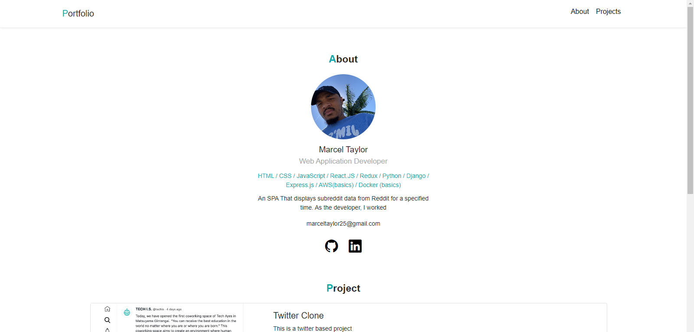

# Portfolio

This is my Portfolio project

 Learn about HTML / CSS / Bootstrap through creation. Also, when they are looking for a job, customize it to create your own portfolio.
[Visit Demo Website](https://port21.marcelt1525.repl.co/)
## Tech used
* HTML
* CSS
## Installation
No need to install anything, just open index.html.
## How to use?
Customize and create your own original portfolio. Take on various challenges such as changing colors, adding effects, and changing designs. Just include ABOUT, PROJECTS, and CONTACT information in your portfolio and don't get too complicated. Simple is the best.

